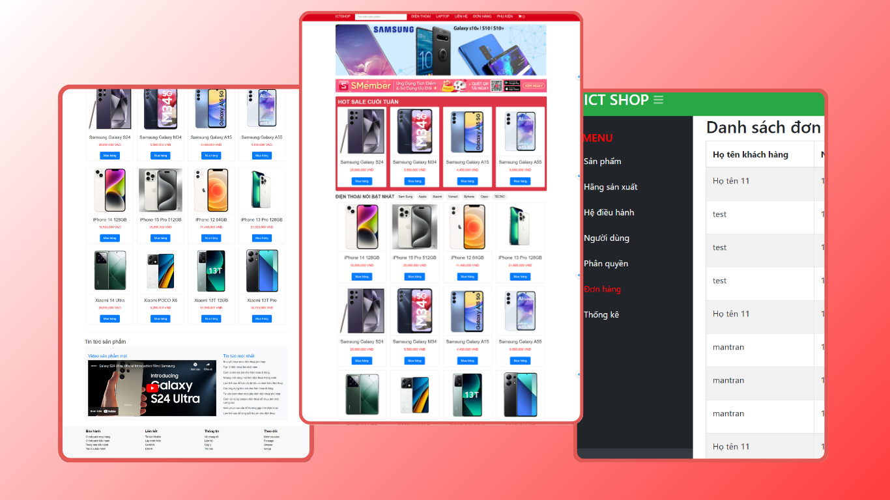

#  **Website bán hàng sử dụng Asp.Net MVC5 + Sql server + Entity Framework**

# Giao diện trang chủ của website ict shop

# Hướng dẫn cài đặt dự án này

1. Tải file 1 trong 2 cách:
   - Download ZIP 
   - `` git clone https://github.com/nguyenvanduydev001/ict-shop.git``
2. Mở thư mục database trong source code có 2 file này  : `QLdienthoai_log.ldf` và `QLdienthoai.mdf` bạn sao chép 2 file này vào đường dẫn này 
3.  : `C:\Program Files\Microsoft SQL Server\MSSQL16.SQLEXPRESS\MSSQL\DATA` Sau đó bạn mở SQL Server lên rồi bạn `attach` và chọn 2 cái file `QLdienthoai_log.ldf` và `QLdienthoai.mdf` hồi nãy bạn thêm vào đường dẫn này : `C:\Program Files\Microsoft SQL Server\MSSQL16.SQLEXPRESS\MSSQL\DATA` là xong bước kết nối Database.
    >**Chú ý** : tuỳ theo máy bạn chỗ này có thể khác mình MSSQL16.SQLEXPRESS nên không cần phải giống.
4. Mở project với Visual Studio file ``ictshop.sln`` => vào file ``Web.config`` => Config lại kết nối từ Visual Studio đến SQL Server
5. Tại thẻ ``<connectionstring> </connectionstring>``thay đổi tên server , tài khoản , mật khẩu kết nối đến sql server nếu không có cần mật khẩu thì bạn bỏ phần điền mật khầu và tên tài khoản.
6. Sau đó Lưu lại `build` lại ứng dụng . 
7. Chạy lên và thưởng thức thôi 😁

#### Nếu làm theo những bước trên bạn có thể tham khảm 2 bước đưới đây :

[Liên kết youtube](https://youtu.be/PppZUa1h4hQ?si=ZUkyH8XEKkrvgEEP) hoặc [Liên kết chatgpt](https://chatgpt.com/)

## Những chức năng có trong website 
- Đăng nhập :

- Tài khoản khách hàng:
  - tk : `Duy@gmail.com`
  - mk : `123456789`
- Tài khoản admin trang quản trị :
  - tk : `Admin@gmail.com`
  - mk : `12345678`
- Phân quyền quản trị và khách hàng
- Bấm mua hàng : giỏ hàng sẽ cập nhật sản phẩm đã chọn.
Có thể chỉnh sửa giỏ hàng 
- Chức năng đặt hàng 
– Kích vào hình ảnh để xem chi tiết sản phẩm
– Đăng nhập tài khoản admin để thêm sửa xóa sản phẩm và các danh mục khác.
>                                                                   Chúc bạn thành công 👍😀

